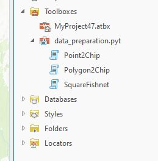
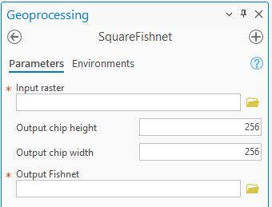
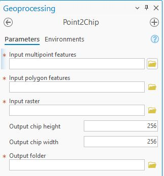
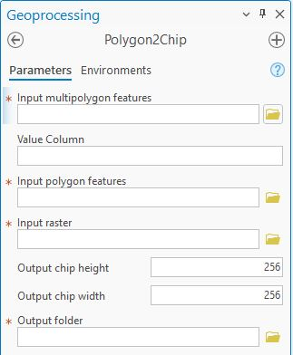

This repository trains MaskRCNN for instance segmentation of dwelling objects from different FDP settlement areas. This is an improved version of [Mapping of Dwellings in IDP/Refugee Settlements from Very High-Resolution Satellite Imagery Using a Mask Region-Based Convolutional Neural Network](https://doi.org/10.3390/rs14030689) where the training scheme accounts for not only performing classical transfer learning from pre-trained weights for combining datasets from different geography and time. This enables not only using pre-trained weight from non-earth observation imagery, it provides ways to properly combine and train on different datasets. It also combines further sampling tools for custom sample selection.

# Instllation
to create the environment follow the instructions on [Instruction_Manual.pdf](https://github.com/getch-geohum/MultiMaskRCNN/blob/master/Installation_Mannual.pdf).

## Usage 
First, try to change parameters in the  configs.py file and then 

for training


```python train.py```

for testing with geospatial outputs

```python geopredict.py```

for finetuning

```python finetune.py ```

## Usage for sample preparation for further finetuning on a selected few samples

In the folder "ArcGISSamplingtool" there is a [data_preparation.pyt](https://github.com/getch-geohum/MultiMaskRCNN/ArcGISSamplingtool/data_preparation.pyt) file containing custom sampling tools usable in the ArcGIS Pro environment. Link the folder in the ArcGIS Pro catalogue pane and it will look like the following pic,



the first is useful to create a custom fishnet



then the two functions will convert point to chips and polygon to chips





see the functionality, and run Python toolboxes for custom fishnet creation as per the input image, and intended individual sample chip size, then select representative polygons where selected digitization could happen. Please note that this would work if the following packages are installed in the environment.
- [geopandas](https://geopandas.org/en/stable/index.html),
- [rasterio](https://rasterio.readthedocs.io/en/latest/index.html#) and
- [shapely](https://shapely.readthedocs.io/en/stable/manual.html) 
